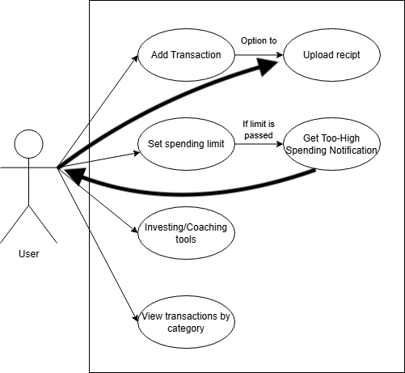

# 1. Postioning
## Problem Statement    

The problem of
the finicial literacy gap 
affects
incoming NAU student popultaion;
the impact of which is
a lack of understanding in managing personal finances, resulting in poor money management, high levels of debt, and stress, which can affect their academic and personal well-being.
The financial struggles often lead to students not being able to save money, properly budget, or plan for future expenses. This problem causes long-term consequences, such as students' inability to make sound financial decisions, increased dependency on loans, and the struggle to build financial independence.

## Product Position Statement    
For
incoming students to NAU between 13-27 years old
Who
lack financial literacy
The Penny Pilot
Penny Pilot is a tech and finance product
That
helps customers save money and become better with their finances
Unlike
Excel and EasyDollar,
Our product
uses lingo that resonates with the younger generation, making financial tracking more accessible and relatable.

## Value proposition and customer segment
Report the value propositions and customer segments of your product. Make sure that your value proposition is coherent with the product position statement and contains the following elements: i) what your product is; ii) the target customer; iii) the value your product provides; and iv) why your product is unique.

Value Proposition:    
Penny Pilot is a tech and finance product (i) designed to help users better manage their finances. It targets incoming college students aged 13-27 years (ii) who struggle with financial literacy and need support in tracking and managing their finances. Penny Pilot provides an easy-to-use platform (iii) that allows students to track their expenses, set spending limits, and understand their finances, ultimately helping them develop responsible financial habits. Unlike traditional tools like Excel or EasyDollar (iv), Penny Pilot stands out by using lingo and language that resonates with the younger generation, making financial concepts more engaging and easier to understand.

Customer Segment:    
Incoming college students aged 13-27 years who lack financial literacy and need help tracking and managing their finances.

# 2. Stakeholders
Make a list of all stakeholders of the project with a brief description of each one of them, emphasizing any responsibilities with the project. Examples of stakeholders include users, clients, competitors, detractors, developers, etc.

1. Users    
Description: Incoming college students (13-27 years old) who need a tool to manage their finances and improve their financial literacy.    
Responsibilities: Provide feedback on usability, features, and overall experience to ensure the product meets their needs.

2. Clients       
Description: Any organizations, university departments, or financial education programs that may adopt or promote Penny Pilot to help students manage their finances.    
Responsibilities: Ensure the product aligns with the needs of the student population and potentially sponsor or promote the tool.

3. Developers    
Description: The team responsible for building, testing, and maintaining the application.    
Responsibilities: Implement functionality, troubleshoot issues, and ensure that the product meets both functional and non-functional requirements.

4. Product Managers    
Description: Individuals responsible for guiding the product's development and ensuring that the team stays on track with project goals.    
Responsibilities: Define product goals, prioritize features, and monitor progress to ensure the product's success in the market.

5. Competitors    
Description: Other finance management tools like Excel, EasyDollar, and other apps targeting college students.    
Responsibilities: Their presence in the market creates competition, and their features help shape the expectations and functionality of Penny Pilot.

6. Investors    
Description: People or entities providing financial support for the development of Penny Pilot.     
Responsibilities: Ensure that the product is commercially viable, profitable, and maintains sustainable growth.

7. Marketing and Sales Team      
Description: The team responsible for promoting the product and ensuring it reaches the target audience effectively.      
Responsibilities: Develop marketing campaigns, manage customer acquisition, and create strategies to reach the desired demographic.

8. Educators/Financial Literacy Programs      
Description: Financial educators or programs at universities or other institutions.      
Responsibilities: Support the educational aspect of the product, possibly endorsing it or integrating it into financial literacy curriculums.

9. Support Team      
Description: The team that provides customer support, handling any issues or questions from users.      
Responsibilities: Offer assistance, resolve user issues, and provide ongoing help to improve the user experience.

10. Regulatory Bodies      
Description: Government or industry regulators that monitor financial services and consumer protection.      
Responsibilities: Ensure that Penny Pilot complies with financial regulations and privacy laws, especially related to managing personal financial data.

# 3. Functional Requirements
Make a numbered list of requirements for your software. Just self-explanatory titles are enough at this point. Remember that requirements should deliver the value proposition and they must be consistent with the interviews you performed for the previous deliverable. You can talk again to your clients to help define the requirements. While writing the requirements, focus on the capabilities needed and not on how they should be implemented.

- Easily Insert and Track Expenses/Income
- Help Calculate Taxes
- Visual Representation of Data

# 4. Non-functional Requirements
## 1. Usability
- Importance: This application should be easy to use and intuitive for users without much financial experience. Poor usability could lead to users dropping the tool altogether.
- Verifiability: User testing with at least 10 participants, where 80% of users should be able to enter an expense/expenses within 3 minutes without outside interference from developers.

## 2. Compatibility
- Importance: The application should integrate well with imported data, like CSV files. Poor integration could lead to data corruption and wasting users' time.
- Verifiability: The system is able to successfully import and export CSV data with no more than 5% formatting errors.

## 3. Accuracy
- Importance: The application should be able to accurately handle financial information. Poor accuracy could lead to unexpected outputs and legal trouble.
- Verifiability: The system is able to correctly handle finances, with each monetary value being accurate with a 2% margin of error.

## 5. Minimum Viable Product  
Our **Minimum Viable Product** will focus on essential functionalities that provide users with instant utility while allowing us to validate core features. The primary objective of the MVP is to allow users to track and control their finances efficiently while being offered insight into their spending habits.  

## Things to test  
The MVP shall have the following main features:  

1.**Adding Transactions** - User is able to input income and expense manually.  
2.**Login Page** - Secure sign in for user.  
3.**Spending Limit** - User can set spending limit and get notifies when near threshold.  
4.**Too-High Spending Notification** - Notifications will alert users when they exceed spending limits in some catagories.  
5.**Sorting Transactions** - Users can arrange transactions by date, category, or amount.  
6.**Saving Data** - Users can view the amount they have saved in the long run.  

## Validation Approach  
The MVP will be validated by:   

-**Implementation & Protocols**: A functional prototype will be built and refined with early adopters to guarantee usability and essential functionality.  
-**User Teting & Feedback**: Initial users will operate the system, providing us with feedback on erase of use, feature priority, and areas for improvement.  
-**A/B Testing**: We'll experiment with different UI elements and spending limit alrets to optimize user interaction.  

Through a focus on these core functionalities, the MVP provides for the availabilty of the most most critical financial mangement features to be both functional and effective beore they bring in advanced features such as **receipt tracking**, **financial tools integration**, and **coaching tools** in later versions.

# 6. Use cases  

## Use Case Diagram  

## Use Case Descriptions

### Use Case 1: Create an Account
Actor: User  
Trigger: User decides to register a new account.  
Pre-conditions: User does not have an existing account.  
Post-condition: User successfully creates an account and can log in.  

Success Scenario:
1. User requests to create an account.
2. System prompts the user for an email/username.
3. System prompts the user for a password that meets our password requirements.
4. User enters the required information.
5. System determines that the provided details are valid.
6. System confirms successful account creation.

Alternate Scenario 1:

5. System determines email/username is invalid/taken
6. System prompts user to choose a new email/username
7. User enters the required information.
8. System determines that the provided details are valid.

Alternate Scenario 2:

5. System determines password has not met requirements.
6. System prompts user to create a password that meets the requirements.
7. User enters the required information.
8. System determines that the provided details are valid.  

### Use Case 2: Logging in to Account
Actor: User  
Trigger: User decides to log into system.  
Pre-conditions: User has an existing account in the system.  
Post-condition: User successfully logs into their account.  

Success Scenario:
1. System prompts the user to enter email/username and password.
2. User enters required information
3. System validates that the email/username exists in the system.  
4. System verifies that the entered password matches the stored password.  
5. System confirms successful login and grants access to the account.  

Alternate Scenario 1:

3. System determines that the email/username does not exist.  
4. System informs user that their email/username is invalid.  
5. System prompts user to re-enter email/username and password.  
6. User enters required information.
 
Alternate Scenario 2:

4. System determines that the password does not match the password associated with email/username.
5. System informs the user that their password is invalid.
6. System produces password recovery button.
7. System prompts user to re-enter password.
8. User enters required information.  

### Use Case 3: Adding a Transaction
Actor: User  
Trigger: User decides to record a financial transaction.  
Pre-conditions: User is logged into their account.  
Post-condition: The transaction is successfully recorded in the system.  

Success Scenario:
1. User requests to add a transaction.
2. System prompts the user to enter transaction details (amount, category, date, description).
3. User provides the required details.
4. System validates the provided information.
5. System confirms that the transaction has been successfully recorded.

Alternate Scenario:  

4. System detects missing or invalid transaction details.  
5. System notifies the user and requests correction.
6. User provides corrected details.  

### Use Case 4: Setting a Spending Limit  
Actor: User  
Trigger: User decides to set a spending limit for a specific category or time period.  
Pre-conditions: User is logged into their account.   
Post-condition: A spending limit is successfully set and stored in the system.

Success Scenario:
1. User requests to set a spending limit.
2. System prompts the user to enter a spending limit amount.
3. User enters the spending limit amount.
4. System prompts the user to select a category and time period.
5. User selects the relevant category and time period.
6. System vlidates the inputs.
7. System confirms that the spending limit has been successfully set.

Alternate Scenario 1:  

6. System detects that the spending limit amount is missing or invalid.  
7. System notifies the user and requests a valid amount.  
8. User enters a corrected amount.  

Alternate Scenario 2:  

6. System detects that the category or time period is missing or invalid.  
7. System notifies the user and requests a valid amount.  
8. User enters a corrected value.   

### Use Case 5: Receiving a Too-High Spending Notification
Actor: User  
Trigger: The system detects that the user's spending exceeds a predefined limit.  
Pre-conditions: User has set a spending limit for a specific category or time period. The system is actively tracking the user's transactions.  
Post-condition: User is notified that their spending has exceeded the limit.  

Success Scenario:
1. User spends money on a transaction.
2. System records the transaction and updates the total spending for the category and time period.
3. System checks if the total spending exceeds the predefined limit.
4. System determines that the spending has surpassed the limit.
5. System generates a notification informing the user that their spending is too high.
6. Systemp resents options for the user to review spending, adjust the limit, or ignore the notification.

Alternate Scenario:  

3. System finds no predefined limit for the transaction category or time period.
4. System allows the transaction without triggering a notification.  

### Use Case 6: Tracking Receipts
Actor: User  
Trigger: User wants to attach a receipt to a recorded transaction.  
Pre-conditions: User is logged into their account. User has at least one recorded transaction in the system.  
Post-condition: The receipt is successfully attached to the transaction and stored in the system.  

Success Scenario:
1. User selects a transaction to attach a receipt to.
2. System prompts the user to upload or capture a receipt.
3. User uploads or takes a photo of the receipt.
4. System validates the uploaded receipt.
5. System associates the receipt with the selected transaction and stores it.
6. System confirms that the receipt has been successfully attached.

Alternate Scenario:  

4. System detects that the uploaded file is in an unsupported format or exceeds size limits.
5. System notifies the user and requests a valid receipt file.
6. User uploads a corrected file.  

# 7. User Stories

1. **User Story:** As a person interested in tracking my finance, I want to register a new account so I can access personalized features.  
   **Priority:** High  
   **Estimation:** 5 Hours  

2. **User Story:** As someone who spends a lot of money, I want to be able to track my spending so I can be more mindful about my finances.  
   **Priority:** High  
   **Estimation:** 4 Hours  

3. **User Story:** As someone who tends to forget passwords, I want a password recovery option so I can regain access to my account.  
   **Priority:** Medium  
   **Estimation:** 3 Hours  

4. **User Story:** As a meticulous budgeter, I want to record a financial transaction so I can effectively track my spending.  
   **Priority:** High  
   **Estimation:** 6 Hours  

5. **User Story:** As a person who tends to go over-budget, I want to set a spending limit so I can control my budget more effectively.  
   **Priority:** High  
   **Estimation:** 5 Hours  

6. **User Story:** As a thoughtful spender, I want to be notified if I exceed my limit so I can be more mindful about my budget.  
   **Priority:** High  
   **Estimation:** 5 Hours  

7. **User Story:** As someone who likes to organize their finances, I want to see spending in different categories so I can better understand my expenses.  
   **Priority:** High  
   **Estimation:** 4 Hours  

8. **User Story:** As a detail-oriented person, I want to be notified if transaction details are missing so I can correct the information before it gets recorded.  
   **Priority:** Medium  
   **Estimation:** 2 Hours  

9. **User Story:** As someone who's finances change over time, I want to update spending limits so that I can adjust my budget according to my financial situation.  
   **Priority:** High  
   **Estimation:** 3 Hours  

10. **User Story:** As someone who keeps reciepts, I want to add attachments to recorded transactions so I have evidence of my expenses.  
   **Priority:** Medium  
   **Estimation:** 3 Hours  

11. **User Story:** As someone who has a lot of transactions, I want to filter transactions so finding a specific one will be easier for me.  
   **Priority:** Medium  
   **Estimation:** 6 Hours  

12. **User Story:** As someone who cares about privacy, I want to set PIN so that I can add an extra layer of security to my account.  
   **Priority:** Medium  
   **Estimation:** 4 Hours  
