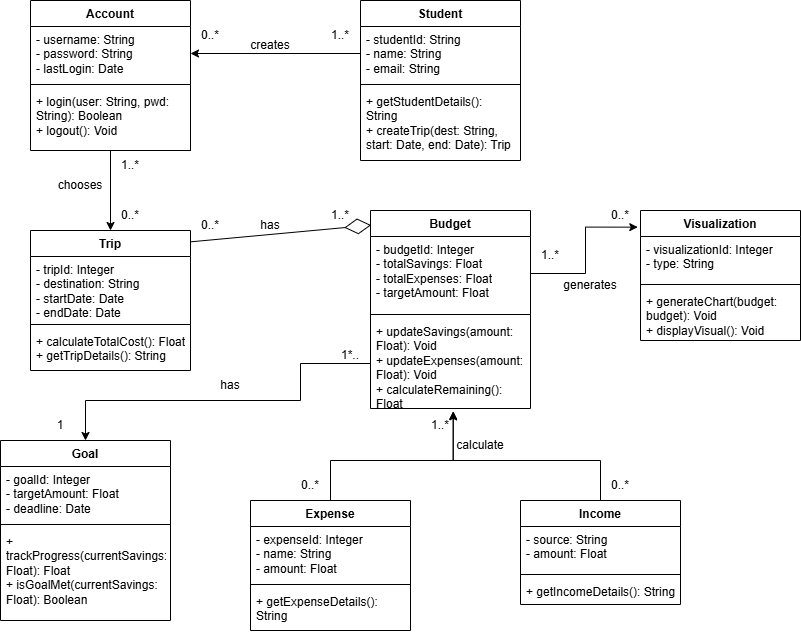

# System Description  

<Problem Statement>Many students face financial barriers when planning a **Trip** to study abroad, lacking tools to budget, set *_targetAmount_*, and track *_totalExpenses_*, discouraging international education and straining the Study Abroad Department. <Product Position Statement>Penny Pilot empowers students by helping them *_updateSavings_*, *_updateExpenses_*, and *_calculateRemaining_* within their **Budget**, offering **Visualization** tools to track progress. Users can *_createTrip_*, set a **Goal**, and monitor financial milestones, ensuring they can focus on studying abroad without financial stress by <Value Proposition> empowering **Students** to plan and save for their _Study Abroad Experience_ with ease. Our user-friendly platform allows **Students** to set _Savings Goals_, track _Budget Plans_, and manage **Transactions** efficiently. By providing tools to organize their _Trip Budget_, **Penny Pilot** helps **Students** focus on their academic journey without financial stress.

<Textual Summary of Stakeholders>The primary users of the system are going to be Northern Arizona University (NAU) students that plan to study abroad. The Study Abroad Department of NAU would also be a stakeholder as they can provide this tool for students to increase enrollment for study abroad terms.<Textual Summary of Functional Requirements>The key functional requirements are the to 1.) allow the student to create an account to store all of their budgeting data, 2.) Allow students to update and track thier trip expenses and income, 3.) Assist users in calculating travel costs, and 4.) Provide clear visualizations so they can monitor their savings progress more efficiently. <Textual Summary of Use Cases>Students can view the total estimated cost of their **plans** for studying abroad, allowing them to make informed financial decisions with the help of an on-demand tool. For those facing financial challenges, the system provides budgeting projections to help determine how long it will take to save enough for their trip. Additionally, **data visualizations** offer an intuitive way for students who are less financially literate to grasp their financial situation and make realistic, achievable **plans** for ***studying abroad***.

# Model  

