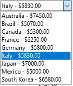
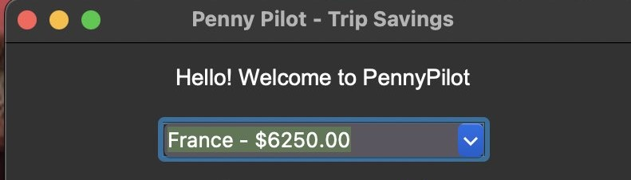
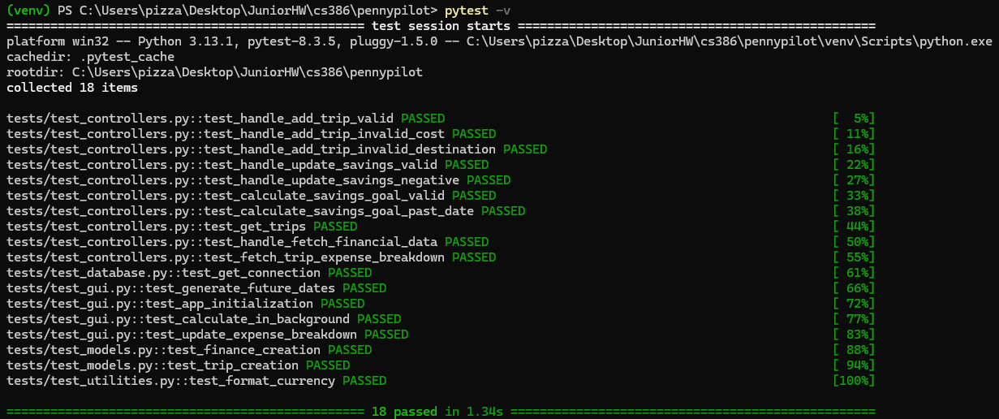

# Introduction
  
**Penny Pilot** is an intuitive financial planning tool designed to help students effectively budget and save for their study abroad experiences. By providing clear **visualizations**, personalized **budget tracking**, and **trip-related expense planning**, Penny Pilot empowers students to make informed financial decisions without stress. The platform allows users to **set savings goals**, track income and expenses, and calculate total travel costs based on **destination** and **duration of stay**. With a user-friendly interface and personalized financial insights, Penny Pilot simplifies the study abroad budgeting process, making international education more accessible. (https://github.com/sesartrumpet/cs386-pennypilot)  

# Requirements

#### Requirement:
> As someone who has a lot of transactions, I want to filter transactions so I can know exactly how much I am spending
 - Issue:
 - Pull Request: 
    - Implemented by:
    - Approved by:
<screenshot>

#### Requirement:
> As someone who is interested in studying in many different countries, I want data on many countries to be readily available.  
 - Issue: [Issue](https://github.com/sesartrumpet/cs386-pennypilot/issues/107)  
 - Pull Request: [Pull Request](https://github.com/sesartrumpet/cs386-pennypilot/pull/128)  
    - Implemented by: Kyle Radzvin    
    - Approved by:Victor Rodriguez    
  

#### Requirement:
> As a new account holder, I want to be able to add and track my trips  
 - Issue: [Issue](https://github.com/sesartrumpet/cs386-pennypilot/issues/115)  
 - Pull Request: [Pull Request](https://github.com/sesartrumpet/cs386-pennypilot/pull/119)  
    - Implemented by: Elijah Sprouse  
    - Approved by: Kyle Radzvin  

#### Requirement:
> As a person who wants to easily manage their finances, I want to be able to see a clear breakdown of my total expenses.  
  - Issue: [Issue](https://github.com/sesartrumpet/cs386-pennypilot/issues/45)  
  - Pull Request: [Pull Request](https://github.com/sesartrumpet/cs386-pennypilot/pull/144), [Pull Request](https://github.com/sesartrumpet/cs386-pennypilot/pull/147)
    - Implemented by: Victor Rodriguez and Manjot Kaur
    - Approved by: Vikram Singh (#144), Victor Rodriguez (#147)

   
#### Requirement:
> As a new user, I want my profile information to displayed on my application for me to see
  - Issue: [Issue](https://github.com/sesartrumpet/cs386-pennypilot/issues/109)
  - Pull Request: [Pull Request](https://github.com/sesartrumpet/cs386-pennypilot/pull/137)
      - Implemented by: Vikram Singh
      - Approved by: Kyle Radzvin
(No screenshot available at the moment)

#### Requirement:
> As a user who wants to change locations, I want to be able to know how my total expenses/savings will change
  - Issue: [Issue]()
  - Pull Request: [Pull Request](https://github.com/sesartrumpet/cs386-pennypilot/pull/119), [Pull Request](https://github.com/sesartrumpet/cs386-pennypilot/pull/147)
      - Implemented by: Victor Rodriguez and Manjot Kaur
      - Approved by: Kyle Radzvin (#119), Victor Rodriguez (#147)
(No screenshot available at the moment)

#### Requirement:
> As a student who wants to manage their finances, I want to see a breakdown of my total savings
  - Issue: [Issue](https://github.com/sesartrumpet/cs386-pennypilot/issues/132)
  - Pull Request: [Pull Request](https://github.com/sesartrumpet/cs386-pennypilot/pull/119), [Pull Request](https://github.com/sesartrumpet/cs386-pennypilot/pull/147)
      - Implemented by: Victor Rodriguez and Manjot Kaur
      - Approved by: Kyle Radzvin (#119), Victor Rodriguez (#147)

# Tests 

We used pytest to test our project.

Test units can be found [here.](https://github.com/sesartrumpet/cs386-pennypilot/tree/main/tests) 

An example of a class we test is Finance, in our [test_models.py](https://github.com/sesartrumpet/cs386-pennypilot/tree/main/tests/test_models.py) file.

This is the result of executing our automated tests:

# Technology    

- **Python:** Used as the primary programming language due to its simplicity, extensive libraries, and strong support for backend development. Python's versatility allows us to efficiently handle financial calculations, data processing, and integration with MySQL.    

- **MySQL:** A robust relational database management system (RDBMS) chosen for its reliability, scalability, and ability to efficiently store and manage user financial data. MySQL enables secure storage of user accounts, budget entries, and trip-related expenses, ensuring data integrity and easy retrieval.    

- **Tkinter:** A built-in Python GUI toolkit used to create a desktop application interface for Penny Pilot. Tkinter allows for an interactive and user-friendly experience, enabling students to input financial data, visualize budgets, and track savings progress in an intuitive way.  
  
# Deployment   
Penny Pilot is designed as a cross-platform desktop application to help students plan study-abroad finances. It is launched via a Python script (main.py) that brings up a user interface built with Tkinter. We are not actively deploying the system to the cloud, the user must download it to their system.  

# Licensing   
For the Penny Pilot project, we adopted the MIT License. This license was chosen because it offers both flexibility and simplicity, allowing anyone to freely use, modify, distribute, and even commercialize the software with minimal restrictions. It is one of the most widely used open-source licenses and is known for encouraging collaboration and broad adoption. The MIT License is easy to understand and includes a clear disclaimer that protects the original authors from liability. Its permissive nature aligns with our goal of making Penny Pilot accessible and adaptable for others who may want to build upon or contribute to the project. To ensure proper attribution and compliance, the license file has been included in the repository, and the GitHub repository has been configured accordingly.  

# Readme File
- **README.md**: [README.md](https://github.com/sesartrumpet/cs386-pennypilot?tab=readme-ov-file#penny-pilot)  
- **CONTRIBUTING.md**: [CONTRIBUTING.md](https://github.com/sesartrumpet/cs386-pennypilot/blob/main/CONTRIBUTING.md)  
- **LICENSE.md**: [LICENSE.md](https://github.com/sesartrumpet/cs386-pennypilot/blob/main/LICENSE.md)  
- **CODE_OF_CONDUCT.md**: [CODE_OF_CONDUCT.md](https://github.com/sesartrumpet/cs386-pennypilot/blob/main/CODE_OF_CONDUCT.md)

**UX Design**    
The UX design of Penny Pilot focuses on simplicity, clarity, and usability for students planning study abroad trips. Using Tkinter, we developed a clean and intuitive desktop interface that allows users to select a destination, set a travel date, and instantly calculate how much they need to save daily, weekly, or monthly to meet their goal. A detailed expense breakdown by category (such as travel, food, housing, and school) is displayed to give users a transparent view of their total estimated costs. The design process began with wireframes and evolved through feedback, which led us to integrate budget tracking directly within the trip planning flow for a more seamless experience. The interface uses dropdown menus, date selectors, and clearly labeled sections to keep the experience user-friendly. Lessons learned include simplifying the scope, focusing on core features, and planning for future enhancements like visual goal progress and app packaging for wider distribution.    

**Lessons Learned**   
During the first release of Penny Pilot, our team faced notable challenges with time management and communication, especially when balancing workloads across different schedules. One of the technical hurdles was working with MySQL, as only one team member had prior experience, which led to a learning curve for the rest of us. Despite this, we’re proud of successfully connecting a working database, which was a major milestone. As development progressed, our scope evolved significantly, we reworked everything from the user interface layout to the type of information we collect for calculating trip costs and savings. Through testing, we realized that some of our original ideas weren’t as essential to the core goal as we thought. For our second release, we plan to expand the database to include more destination options for students, improve the UI for a more polished and engaging user experience, and package the application so it can be distributed as a standalone desktop app.

**Demo**   
[Demo Video](https://youtu.be/13Ac6QHr6JM)

