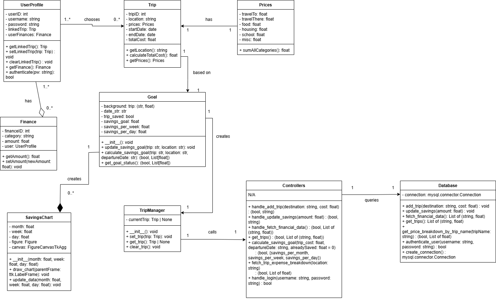

# Description
PennyPilot is a desktop application built in Python using Tkinter for the user    
interface and MySQL for backend data persistence. It is specifically designed to     
assist students in budgeting for their study abroad trips. The application allows     
users to securely log in, create and manage trip entries, and track savings     
progress toward a destination-specific financial goal. With just three key      
inputs—destination, current savings, and timeline—users can begin monitoring     
their savings progress on a dynamic progress screen. This screen provides visual      
insights, including a breakdown of trip costs and real-time updates reflecting    
the user’s financial input.

At the heart of PennyPilot’s design is simplicity and clarity. When users     
revisit the app, they're immediately taken to their existing progress screen      
unless they opt to modify the trip details. This flow reduces friction and helps     
users remain focused on achieving their savings goal. The application architecture     
is structured around clear separation of concerns: the UI layer (Tkinter) handles     
user interaction, the controller layer encapsulates business logic, and the      
persistence layer manages data transactions with the MySQL database. Additionally,      
PennyPilot applies the Observer Pattern to update the UI when savings data changes     
and uses the Singleton Pattern to manage a single, consistent database connection     
throughout a user session. This structured, layered architecture improves       
maintainability, scalability, and testability.

# Architecture    

PennyPilot is a desktop application that helps students planning to study abroad   
manage trip-related finances. The app allows users to log in securely, create    
trips, estimate total costs based on location-specific price breakdowns,   
and track savings toward their goal. Users can also view detailed breakdowns of   
expenses and visualize their savings progress through an interactive chart. The   
system connects to a MySQL database to persist user credentials, trip data, and    
financial records, ensuring data is accessible across sessions.
This system is built using Python with Tkinter for the graphical user interface,    
and follows a multi-layered architecture that cleanly separates the user interface,    
application logic, and data management responsibilities.


# Class Diagrams   



# Sequence Diagrams   


## Use Case Description

| Use Case         | Viewing Trip Details                                                                                                                      |
|------------------|-------------------------------------------------------------------------------------------------------------------------------------------|
| Use Case Description | This use case describes the process where the student views trip details from the application. This is done by selecting the trip dropdown to provide the user with a list of trips. After selecting the trip, the screen will populate with a price breakdown for the trip the student selected. |
| Actors           | Student                                                                                                                                   |
| Preconditions    | Student is logged into the PennyPilot app and at least one trip exists in the database.                                                   |
| Basic scenario   | 1. **Student** clicks on the trip dropdown in the PennyPilotApp interface.  <br> 2. **Trip Manager** sends a request to **Controllers** to retrieve available trips via the `get_trips()` method.  <br> 3. **Controllers** request trip data from the **Database** using the `get_trips()` method.  <br> 4. **Database** returns a list of trips to the **Controllers**.  <br> 5. **Controllers** pass the list of trips to the **Trip Manager**.  <br> 6. **Trip Manager** displays the list of trips in a dropdown menu.  <br> 7. **Student** selects a specific trip from the dropdown.  <br> 8. **Trip Manager** calls the `fetch_trip_expense_breakdown(location)` function in the **Controllers**.  <br> 9. **Controllers** call the `get_price_breakdown_by_trip_name(location)` function in the **Database**.  <br> 10. **Database** returns the price breakdown to **Controllers**.  <br> 11. **Controllers** return the price breakdown data to the **Trip Manager**.  <br> 12. **Trip Manager** displays the price breakdown to the **Student**. |
| Alternate scenario | 1. If no trips are available, the application will throw an error and the user will not be able to select any trips |
| Postconditions   | The user successfully views the detailed price breakdown of the selected trip.                                                           |

# Design Patterns     
Penny Pilot uses two classic software design patterns to enhance modularity, maintainability, and data synchronization: the **Observer Pattern** (Behavioral) and the **Singleton Pattern**(Creational). Each was selected based on its practical application within the savings-tracking architecture of the system.   

- **Observer Pattern(Behavioral)**
The Observer Pattern enables dynamic updates of the user interface whenever the savings data changes. This is critical in Penny Pilot, where users want to track their progress in real-time after inputting or adjusting their savings and trip information.


[https://github.com/sesartrumpet/cs386-pennypilot/blob/main/Reports/Deliverable5_images/Observer%20Pattern.drawio.png](https://github.com/sesartrumpet/cs386-pennypilot/blob/main/Reports/Deliverable5_images/Observer%20Pattern.drawio%20(1).png)

  
- **Singleton Pattern(Creational)**
The Singleton Pattern is used to manage the database connection via DatabaseConnector. This ensures only one connection to the MySQL database is active at a time across the application, preventing resource waste and maintaining centralized access to persistent data.

[https://github.com/sesartrumpet/cs386-pennypilot/blob/main/Reports/Deliverable5_images/Singleton%20Pattern.drawio.png](https://github.com/sesartrumpet/cs386-pennypilot/blob/main/Reports/Deliverable5_images/Observer%20Pattern.drawio.png)

 


# Design Principles   

**1. Single Responsibility Principle (SRP)**

   Each class in Penny Pilot is responsible for one well-defined task. For example:

- The ```DatabaseConnection``` class manages only the MySQL connection setup and execution of queries. It does not contain any UI or application logic.

- Similarly, the ```SavingsProgressController``` handles the logic for updating savings and retrieving trip-related data, separating it from both the database and UI responsibilities.

- The ```PennyPilotApp``` (UI class) is only responsible for rendering the GUI and handling user interactions, such as button clicks or field inputs.

   By separating these concerns, our code is easier to maintain and test, and changes in one part of the application do not inadvertently affect others.

**2. Open/Closed Principle (OCP)**

   Penny Pilot’s architecture is designed to allow extension without modifying existing code. For instance:

- The ```calculate_goal()``` function in the ```TripController``` uses location and timeline as parameters. If we later add support for new cost factors (e.g., currency conversion or accommodation type), we can extend the logic through subclassing or strategy-based injection rather than modifying the core controller class.

- The expense breakdown visualization is modular. Adding a new type of chart (e.g., pie chart vs. bar chart) can be achieved by adding a new visualization class that inherits from a base chart class.

   This promotes code reuse and makes future feature additions smoother.

**3. Dependency Inversion Principle (DIP)**

The high-level modules in Penny Pilot (such as the UI and controllers) do not directly depend on low-level database details. Instead:

- The application interacts with the database through an abstract ```DatabaseInterface```, allowing us to easily swap the MySQL backend with a mock or different storage system for testing or future scalability.

- Our ```Controller``` classes depend on this abstraction rather than on specific database implementations, reducing tight coupling and increasing testability.

   This inversion of dependency ensures that high-level policy remains unaffected by low-level changes, aligning with clean architecture principles.
