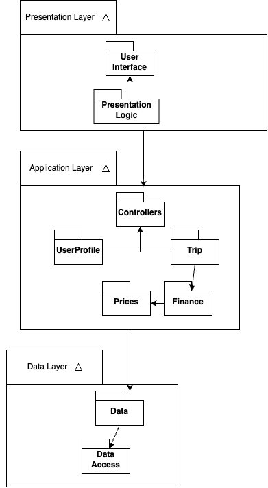

# Description
Penny Pilot is a desktop GUI application built with Python, Tkinter, and MySQL,  
designed to help students plan and track savings for study abroad trips.  
The system focuses on simplicity by only asking for three key inputs: destination,  
current savings, and trip timeline. Once all three fields are filled out,  
the interface transitions to a dedicated “Progress Screen” where users can monitor  
and update their savings over time. The savings goal is automatically calculated  
based on the location and timeline, and a visual breakdown is shown to help users  
stay on track. 
When the user reopens the app, they are brought directly to the Progress Screen  
to continue updating their savings. Whenever savings are updated, both the savings  
breakdown and goal chart dynamically reflect the new data to provide real-time  
feedback. This ensures users can clearly see how their progress has changed and  
what remains to be saved. Only if the user decides to change trip details—such  
as the destination or timeline—does the app return to the initial “Select Trip”  
screen. This streamlined design keeps the user focused on goal progress while  
minimizing distractions, aligning with Penny Pilot’s mission to make trip planning  
straightforward and motivating.    

# Architecture    

PennyPilot is a desktop application that helps students planning to study abroad   
manage trip-related finances. The app allows users to log in securely, create    
trips, estimate total costs based on location-specific price breakdowns,   
and track savings toward their goal. Users can also view detailed breakdowns of   
expenses and visualize their savings progress through an interactive chart. The   
system connects to a MySQL database to persist user credentials, trip data, and    
financial records, ensuring data is accessible across sessions.
This system is built using Python with Tkinter for the graphical user interface,    
and follows a multi-layered architecture that cleanly separates the user interface,    
application logic, and data management responsibilities.


# Class Diagrams   

# Sequence Diagrams   


## Use Case Description

| Use Case         | Viewing Trip Details                                                                                                                      |
|------------------|-------------------------------------------------------------------------------------------------------------------------------------------|
| Use Case Description | This use case describes the process where the student views trip details from the application. This is done by selecting the trip dropdown to provide the user with a list of trips. After selecting the trip, the screen will populate with a price breakdown for the trip the student selected. |
| Actors           | Student                                                                                                                                   |
| Preconditions    | Student is logged into the PennyPilot app and at least one trip exists in the database.                                                   |
| Basic scenario   | 1. **Student** clicks on the trip dropdown in the PennyPilotApp interface.  <br> 2. **PennyPilotApp** sends a request to **Controllers** to retrieve available trips via the `get_trips()` method.  <br> 3. **Controllers** request trip data from the **Database** using the `get_trips()` method.  <br> 4. **Database** returns a list of trips to the **Controllers**.  <br> 5. **Controllers** pass the list of trips to the **PennyPilotApp**.  <br> 6. **PennyPilotApp** displays the list of trips in a dropdown menu.  <br> 7. **Student** selects a specific trip from the dropdown.  <br> 8. **PennyPilotApp** calls the `update_expense_breakdown(location)` function in the **Controllers**.  <br> 9. **Controllers** call the `get_price_breakdown_by_trip_name(location)` function in the **Database**.  <br> 10. **Database** returns the price breakdown to **Controllers**.  <br> 11. **Controllers** return the price breakdown data to the **PennyPilotApp**.  <br> 12. **PennyPilotApp** displays the price breakdown to the **Student**. |
| Alternate scenario | 1. If no trips are available, the application will throw an error and the user will not be able to select any trips |
| Postconditions   | The user successfully views the detailed price breakdown of the selected trip.                                                           |

# Design Patterns     
Penny Pilot uses two classic software design patterns to enhance modularity, maintainability, and data synchronization: the **Observer Pattern** (Behavioral) and the **Singleton Pattern**(Creational). Each was selected based on its practical application within the savings-tracking architecture of the system.   

- **Observer Pattern(Behavioral)**
The Observer Pattern is used in Penny Pilot to dynamically update the UI whenever the savings value changes. This makes the savings interface reactive and ensures the user always sees up-to-date progress and goal information without manual refresh or reload actions.
https://github.com/sesartrumpet/cs386-pennypilot/blob/main/Reports/Deliverable5_images/Observer%20Pattern.drawio.png

  
- **Singleton Pattern(Creational)**
The Singleton Pattern is used in Penny Pilot to manage the MySQL database connection efficiently. It ensures that the application always uses the same database instance throughout the user session, avoiding the creation of multiple unnecessary connections.
https://github.com/sesartrumpet/cs386-pennypilot/blob/main/Reports/Deliverable5_images/Singleton%20Pattern.drawio.png

 


# Design Principles   

**1. Single Responsibility Principle (SRP)**

   Each class in Penny Pilot is responsible for one well-defined task. For example:

- The ```DatabaseConnection``` class manages only the MySQL connection setup and execution of queries. It does not contain any UI or application logic.

- Similarly, the ```SavingsProgressController``` handles the logic for updating savings and retrieving trip-related data, separating it from both the database and UI responsibilities.

- The ```PennyPilotApp``` (UI class) is only responsible for rendering the GUI and handling user interactions, such as button clicks or field inputs.

   By separating these concerns, our code is easier to maintain and test, and changes in one part of the application do not inadvertently affect others.

**2. Open/Closed Principle (OCP)**

   Penny Pilot’s architecture is designed to allow extension without modifying existing code. For instance:

- The ```calculate_goal()``` function in the ```TripController``` uses location and timeline as parameters. If we later add support for new cost factors (e.g., currency conversion or accommodation type), we can extend the logic through subclassing or strategy-based injection rather than modifying the core controller class.

- The expense breakdown visualization is modular. Adding a new type of chart (e.g., pie chart vs. bar chart) can be achieved by adding a new visualization class that inherits from a base chart class.

   This promotes code reuse and makes future feature additions smoother.

**3. Dependency Inversion Principle (DIP)**

The high-level modules in Penny Pilot (such as the UI and controllers) do not directly depend on low-level database details. Instead:

- The application interacts with the database through an abstract ```DatabaseInterface```, allowing us to easily swap the MySQL backend with a mock or different storage system for testing or future scalability.

- Our ```Controller``` classes depend on this abstraction rather than on specific database implementations, reducing tight coupling and increasing testability.

   This inversion of dependency ensures that high-level policy remains unaffected by low-level changes, aligning with clean architecture principles.
