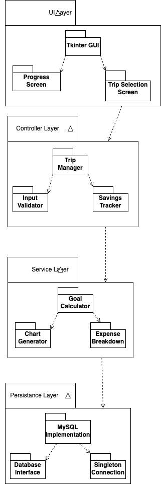

# Description
PennyPilot is a desktop application built in Python using Tkinter for the user    
interface and MySQL for backend data persistence. It is specifically designed to     
assist students in budgeting for their study abroad trips. The application allows     
users to securely log in, create and manage trip entries, and track savings     
progress toward a destination-specific financial goal. With just three key      
inputs—destination, current savings, and timeline—users can begin monitoring     
their savings progress on a dynamic progress screen. This screen provides visual      
insights, including a breakdown of trip costs and real-time updates reflecting    
the user’s financial input.

At the heart of PennyPilot’s design is simplicity and clarity. When users     
revisit the app, they're immediately taken to their existing progress screen      
unless they opt to modify the trip details. This flow reduces friction and helps     
users remain focused on achieving their savings goal. The application architecture     
is structured around clear separation of concerns: the UI layer (Tkinter) handles     
user interaction, the controller layer encapsulates business logic, and the      
persistence layer manages data transactions with the MySQL database. Additionally,      
PennyPilot applies the Observer Pattern to update the UI when savings data changes     
and uses the Singleton Pattern to manage a single, consistent database connection     
throughout a user session. This structured, layered architecture improves       
maintainability, scalability, and testability.

# Architecture    

PennyPilot is a desktop application that helps students planning to study abroad   
manage trip-related finances. The app allows users to log in securely, create    
trips, estimate total costs based on location-specific price breakdowns,   
and track savings toward their goal. Users can also view detailed breakdowns of   
expenses and visualize their savings progress through an interactive chart. The   
system connects to a MySQL database to persist user credentials, trip data, and    
financial records, ensuring data is accessible across sessions.
This system is built using Python with Tkinter for the graphical user interface,    
and follows a multi-layered architecture that cleanly separates the user interface,    
application logic, and data management responsibilities.

# Class Diagrams   

# Sequence Diagrams   

| Use Case         | Viewing Trip Details                                                                                                                      |
|------------------|-------------------------------------------------------------------------------------------------------------------------------------------|
| Summary          | This use case describes the process where the user selects a trip from the dropdown of trips, and then the application returns the trip price breakdown. |
| Actors           | Student                                                                                                                                   |
| Preconditions    | Student is logged into the PennyPilot app and at least one trip exists in the database.                                                   |
| Basic sequence   | 1. **Student** clicks on the trip dropdown in the PennyPilotApp interface.    2. **PennyPilotApp** sends a request to **Controllers** to retrieve available trips via the `get_trips()` method.    3. **Controllers** request trip data from the **Database** using the `get_trips()` method.    4. **Database** returns a list of trips to the **Controllers**.    5. **Controllers** pass the list of trips to the **PennyPilotApp**.    6. **PennyPilotApp** displays the list of trips in a dropdown menu.    7. **Student** selects a specific trip from the dropdown.    8. **PennyPilotApp** calls the `update_expense_breakdown(location)` function in the **Controllers**.    9. **Controllers** call the `get_price_breakdown_by_trip_name(location)` function in the **Database**.    10. **Database** returns the price breakdown to **Controllers**.    11. **Controllers** return the price breakdown data to the **PennyPilotApp**.    12. **PennyPilotApp** displays the price breakdown to the **Student**. |
| Alternate Sequence | 1. If no trips are available, the application will throw an error and the user will not be able to select any trips |
| Postconditions   | The user successfully views the detailed price breakdown of the selected trip.                                                           |

# Design Patterns   

# Design Principles  git 