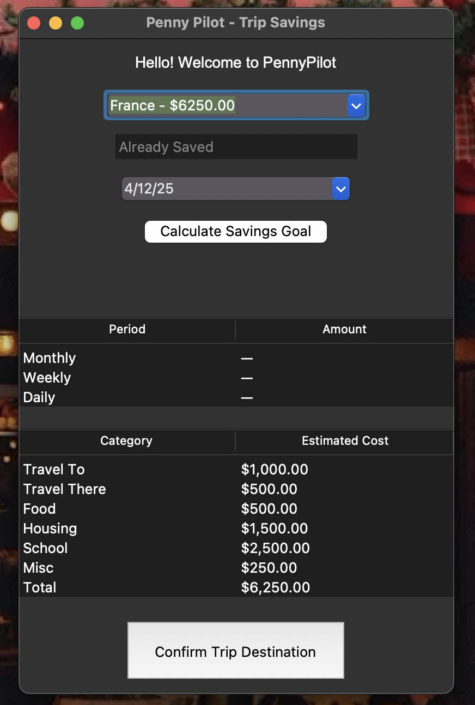
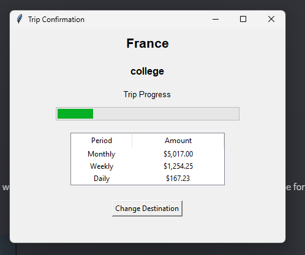
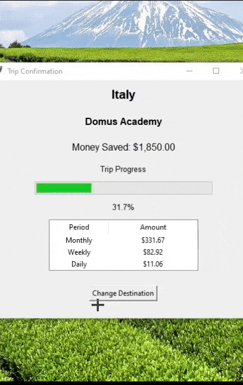
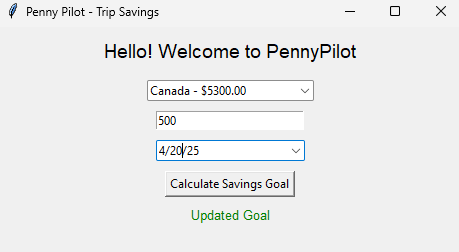
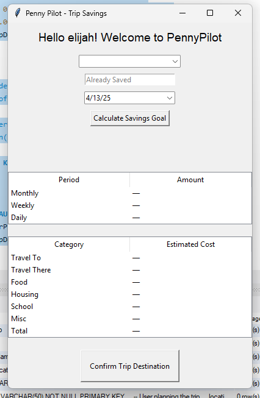
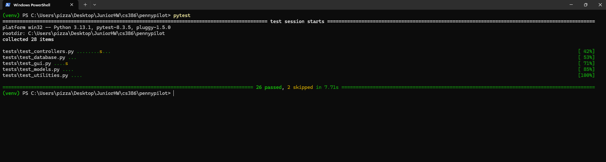

### **Introduction**

PennyPilot is a personal finance management tool designed for students planning to study abroad. The application helps users calculate savings goals based on their trip timeline and location, offering personalized daily, weekly, and monthly savings targets. Users input their destination, trip date, and current savings to receive actionable insights and visual feedback to stay on track.

The system connects to a MySQL database to retrieve and update trip data, tracks savings over time, and dynamically updates charts using Python's Tkinter for GUI and Matplotlib for visualization. With a strong focus on usability and clarity, PennyPilot simplifies financial planning and motivates users to achieve their study-abroad goals.

**GitHub Repository**:https://github.com/sesartrumpet/cs386-pennypilot

---

### **Requirements**

#### **Requirement 1: As a Student, I want to select a trip and view its expense breakdown so I can understand the financial requirements.**

* **Issue**: https://github.com/sesartrumpet/cs386-pennypilot/issues/112
* **Pull Request**: https://github.com/sesartrumpet/cs386-pennypilot/pull/212
* **Implemented by**: Victor Rodriguez
* **Approved by**: ktr66nau (Kyle Radzvin)
* **Screenshot**: 

This requirement was successfully implemented with the following features:
- Fixed trip table structure with proper schema
- Updated date fields (dateStart and dateSelected) for better handling
- Improved GUI date handling in confirm trip functionality
- Added DROP TABLE functionality for clean database updates
- Enhanced data validation and error handling
- Ensured proper date format consistency across the application

#### **Requirement 2: As a Student, I want to input my current savings and trip end date so I can calculate my savings goals.**

* **Issue**: https://github.com/sesartrumpet/cs386-pennypilot/issues/219
* **Pull Request**: https://github.com/sesartrumpet/cs386-pennypilot/pull/218
* **Implemented by**: pizzadogsquared (Elijah Sprouse)
* **Approved by**: ktr66nau (Kyle Radzvin)
* **Screenshot**:  

This requirement was successfully implemented with the following features:
- Trip information is successfully saved to user profile
- Button added to calculation screen to transfer to progress screen
- Progress bar depicting how much money is already saved for trip
- Location, university, savings, and other pertinent information displayed on progress screen

#### **Requirement 3: As a Student, I want to view a breakdown of my trip saving progress so I know what to save.** 

* **Issue**: [(Issue Link)](https://github.com/sesartrumpet/cs386-pennypilot/issues/229)  
* **Pull Request**:   https://github.com/sesartrumpet/cs386-pennypilot/pull/218
* **Implemented by**: Manjot kaur  
* **Approved by**:  ktr66nau (Kyle Radzvin)
* **Screenshot**:

#### **Requirement 4: As a Student, I want to change my trip location so I can explore different options and adjust my plans.** 

* **Issue**: [Issue Link](https://github.com/sesartrumpet/cs386-pennypilot/issues/209)
* **Pull Request**: [Pull Request](https://github.com/sesartrumpet/cs386-pennypilot/pull/220)
* **Implemented by**: Kyle Radzvin
* **Approved by**:  D3VTHSTVR (Victor Rodriguez)
* **Screenshot**: 

#### **Requirement 5: As a cautious student, I want to be sure I am looking at the correct savings goal so I can be confident about my savings.** 

* **Issue**: [Issue Link](https://github.com/sesartrumpet/cs386-pennypilot/issues/213)
* **Pull Request**: [Pull Request](https://github.com/sesartrumpet/cs386-pennypilot/pull/215)
* **Implemented by**: sesartrumpet (Sesar Parra)  
* **Approved by**: D3VTHSTVR (Victor Rodriguez)
* **Screenshot**:

#### **Requirement 6: As a new account holder, I want my profile information to displayed on my screen for a more personalized experience** 

* **Issue**: [Issue Link](https://github.com/sesartrumpet/cs386-pennypilot/issues/109)
* **Pull Request**: [Pull Request](https://github.com/sesartrumpet/cs386-pennypilot/pull/235)
* **Implemented by**: Vikram Singh  
* **Approved by**: Elijah Sprouse
* **Screenshot**:

---

### **Tests**

* **Test Framework**: `pytest` (Python Standard Library)  
* **Test Folder**: \[[GitHub Link](https://github.com/sesartrumpet/cs386-pennypilot/tree/main/tests)\]  
* **Test Case**: Initialization logic for Finance class in [test_utilities.py](https://github.com/sesartrumpet/cs386-pennypilot/blob/main/tests/test_utilities.py):
  * **Test Class**:  Finance
* **Test Output Screenshot**:

---

### **Demo**

**Demo Video**: [Demo Video](https://youtu.be/Zw0kEvVKwtE)

---

### **Code Quality**

To ensure a high standard of code quality, our team adopted several best practices. We maintained consistent naming conventions for all variables and functions to improve readability and reduce confusion. Our architecture separated logic into controllers and GUI classes, enhancing modularity and maintainability. Every pull request was thoroughly reviewed on GitHub before merging to catch potential issues early. We documented all functions and classes using docstrings, which promoted clarity and ease of understanding. Additionally, we applied relevant design patterns such as Singleton for the DatabaseConnector and Observer to ensure that model updates triggered view changes appropriately. We also avoided code duplication by adhering to the DRY (Don't Repeat Yourself) principle.

---

### **Lessons Learned**

Through this project, we identified several important takeaways. First, punctuality for all in-person meetings is essential for maintaining alignment and team progress. Second, it is critical to validate and test code thoroughly before merging into the main branch to prevent errors and ensure reliability. Consistent and timely commits help track changes effectively and support better version control. Lastly, making sure that every team member is familiar with all aspects of the codebase ensures smoother collaboration and allows everyone to contribute more effectively.

---
