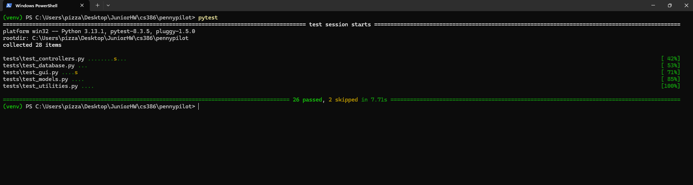

# Deliverable 7

## Description

---

## Verification

### Test Framework  
`pytest` (Python Standard Library)

### GitHub Repository (Unit Tests)  
\[[GitHub Link](https://github.com/sesartrumpet/cs386-pennypilot/tree/main/tests/backend)\]

### Example Test Case with Mock Objects  
Initialization logic for Finance class in [test_utilities.py](https://github.com/sesartrumpet/cs386-pennypilot/blob/main/tests/backend)

### Test Execution Screenshot  

---

## Acceptance Test

### Test Framework

### GitHub Repository (Acceptance Tests)

### Example Acceptance Test

### Test Execution Screenshot or Video

---

## Validation

### Participant 1 Evaluation

#### Results

**Task Completion Time:**

- Task 1 (Create a New Trip): 3 minutes
- Task 2 (Update Savings): 2 minutes
- Task 3 (View Trip Breakdown): 4 minutes

**Ratings:**

1. Creating a Trip: 8/10
   - *Explanation:* The user found the process intuitive and straightforward, requiring minimal effort to complete. There's still room for improvement in user interface clarity or guidance.

2. Saving Progress Update: 7/10
   - *Explanation:* While the user was able to update their savings, they felt the feature could be more seamless or better integrated with other features. Slight confusion in the savings progress tracking was noted.

3. Trip Breakdown: 9/10
   - *Explanation:* The user found the trip breakdown feature clear and easy to navigate. The expense categories were helpful, and there were no major issues in understanding or interacting with the data.

**Feedback:**

> "The app is pretty easy to use, but it would be great if I could add custom categories for expenses. I think the bar graph could be more prominent."

#### Reflection

**Observations:**

- The user completed all tasks with little difficulty, indicating that the core features of the app are functional and user-friendly.
- The suggestion to add custom categories for expenses reflects a need for more flexibility in how users manage their trip budgets. This could improve the app's usability for users with diverse needs.
- The user's feedback about the progress bar suggests that a more prominent visual representation of savings could enhance the overall user experience, making it more engaging and easier to track goals.

**What Worked Well:**

- The process of creating a new trip was clear and intuitive, with users able to quickly set up trips with ease.
- The trip breakdown feature received positive feedback, indicating that the categorization of expenses and the data presentation were well-received.

**Areas for Improvement:**

- Custom categories for expenses could make the app more versatile, catering to a broader range of users.
- Enhancing the visibility and prominence of the savings progress bar could improve user engagement and help users track their goals more effectively.
